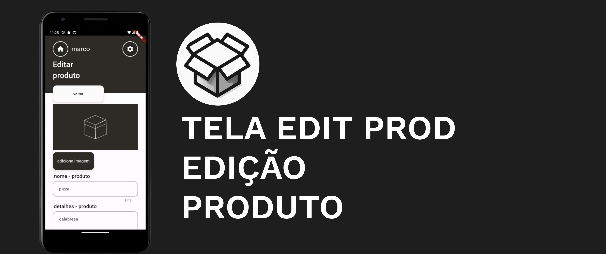

- Acesso rapido
  - [sobre organização de pastas](/arquitetura-app/README.md)
  - [como inciar o projeto](#iniciando-o-projeto)
  - [dependencias utilizadas](#dependências)
  - [download do app - v2.0 estavel ](https://github.com/marco0antonio0/app-box-gerenciamento/releases/tag/v2)
  - [download do app - v2.1 instavel - feature camera ](https://github.com/marco0antonio0/app-box-gerenciamento/releases/tag/v2.1)
  - [compatibilidade](#compatibilidade)

O **Box Gerenciamento** é um aplicativo desenvolvido em Flutter para facilitar o gerenciamento de estoque de produtos. Com funcionalidades intuitivas e uma interface amigável, o aplicativo oferece uma solução completa para o controle de produtos, desde a adição até a alteração e exclusão.

## Informações Gerais


- **Nome do App:** Box Gerenciamento
- **Desenvolvido em:** Flutter
- **Persistência de Dados:** SQLite (Sqflite)

### Compatibilidade

<table>
    <tr>
        <th>Versão do Android</th>
        <th>v1 - Feature camera - beta instável </th>
        <th>v2  - disable Feature camera - estável </th>
        <th>v2.1 - Feature camera - beta instável</th>
        <th>responsivo</th>
    </tr>
    <tr>
        <td>Android 7 (Nougat)</td>
        <td>---------</td>
        <td>✅</td>
        <td>em andamento</td>
        <td>✅</td>
    </tr>
    <tr>
        <td>Android 8 (Oreo)</td>
        <td>---------</td>
        <td>✅</td>
        <td>em andamento</td>
        <td>✅</td>
    </tr>
    <tr>
        <td>Android 9 (Pie)</td>
        <td>---------</td>
        <td>✅</td>
        <td>em andamento</td>
        <td>✅</td>
    </tr>
    <tr>
        <td>Android 10</td>
        <td>---------</td>
        <td>✅</td>
        <td>✅</td>
        <td>✅</td>
    </tr>
    <tr>
        <td>Android 11</td>
        <td>---------</td>
        <td>✅</td>
        <td>✅</td>
        <td>✅</td>
    </tr>
    <tr>
        <td>Android 12</td>
        <td>---------</td>
        <td>✅</td>
        <td>✅</td>
        <td>✅</td>
    </tr>
    <tr>
        <td>Android 13 </td>
        <td>---------</td>
        <td>✅</td>
        <td>✅</td>
        <td>✅</td>
    </tr>
</table>

## Permissões Necessárias

Para garantir o pleno funcionamento do aplicativo, são necessárias as seguintes permissões:

- **Câmera:** Para utilização de funcionalidades relacionadas à câmera.
- **Armazenamento:** Para acesso e armazenamento de dados no dispositivo para salvamento dos dados relacionais a _feature camera_.

## Dependências

O projeto utiliza diversas dependências para aprimorar a experiência do usuário e garantir funcionalidades avançadas. Algumas das principais dependências incluem:

- **auto_size_text:** Usada para garantir a responsividade de elementos de texto.
- **device_preview:** Utilizada para testes unitários manuais e identificação de erros relacionados à estética do UI.
- **sqflite:** Responsável pela persistência de dados no SQLite.
- **url_launcher:** Utilizada para navegação para rotas no navegador.
- **get:** Utilizada para o controle de estado do aplicativo.
- **camera_camera:** Implementa a funcionalidade de câmera e gerencia permissões relacionadas.
- **flutter_launcher_icons:** Utilizada para implementar o design de ícones do aplicativo.

## Arquitetura

O aplicativo segue a arquitetura em MVC (Model-View-Controller), proporcionando uma organização clara e eficiente do código.

## Funcionalidades Principais


### Página Home


- Lista de produtos com informações detalhadas (foto, título, descrição, valor, quantidade disponível).
- Navegação para a página do produto ao clicar em um item da lista.
- Adição de novos produtos ao estoque.
- Visualização da quantidade total de produtos em estoque.

### Página Produto


- Detalhes do produto, incluindo nome, descrição, data de alteração, data de criação, quantidade disponível em estoque e valor total.
- Botão para acessar a página de alteração do produto.

### Página de Alteração



- Alteração das informações do produto (exceto data de criação e data de atualização).
- Possibilidade de incrementar e decrementar a quantidade em estoque.
- Exclusão do produto.

### Página de Configuração


- Alteração de dados cadastrais do usuário.
- Exclusão de todos os produtos.
- Visualização de informações sobre o aplicativo.

## Topbar

- Acesso rápido à página inicial.
- Acesso ao menu de configurações.
- Identificação do usuário logado.

## Observações

O aplicativo proporciona uma experiência intuitiva e eficiente para o gerenciamento de estoque de produtos, facilitando o controle e a visualização das informações. Em todas as telas, a topbar oferece acesso rápido, garantindo praticidade ao usuário.

Para mais informações sobre o aplicativo, consulte a página de configuração, onde é possível realizar alterações nos dados cadastrais do usuário, excluir todos os produtos e obter informações detalhadas sobre o aplicativo.

## Componentes construido é reutilizavel em diversas parte do app

Components utilizados e organizados em :

```
projeto/lib/components
```


## Iniciando o Projeto

Siga os passos abaixo para iniciar o projeto:

1.  **Instalação do Flutter:**
    Certifique-se de ter o Flutter e o Dart SDK instalados no seu ambiente de desenvolvimento. Se ainda não tiver, siga as instruções na [documentação oficial do Flutter](https://flutter.dev/docs/get-started/install).

2.  **Clone o Repositório:**
    ```bash
    git clone https://github.com/marco0antonio0/app-box-gerenciamento.git
    ```
3.  **Navegue até o Diretório do Projeto:**

    ```bash
    cd app-box-gerenciamento
    ```

4.  **Abra o Projeto no Editor:**
    Abra o projeto no seu editor de código preferido. Por exemplo, se estiver usando o Visual Studio Code, execute:

    ```bash
    code .
    ```

5.  **Instale as Dependências:**

    ```bash
    flutter pub get
    ```

6.  **Execute o Aplicativo:**

    ```bash
    flutter run
    ```

---

## Observações

### Funcionalidade feature camera - dependencia camera_camera:

Feature camera ,utilizado a dependencia **camera_camera**. Para ativar esta funcionalidade set em _main.dart_ como true:

```dart
//=======================================
//           Função nova
//      camera acessos a fotos
final FetueareCamera = false; // set para true para ativar a funcionalidade
```

### Teste de responsividade - dependencia device_preview:

Para ativar o modo teste em responsividade e poder alterar tamanho da tela em uma emulação android com a dependencia **device_preview**, para isso set como true para ativar a funcionalidade:

```dart
//=======================================
// debugMode:
// refere-se a adaptação da tela em
// diversos cenarios
final debugMode = false;
```

---

## Feramentas utilizadas

- ## Dev
  - vscode
  - android Studio
  - prog dart flutter
  - pub.dev dependencias
- ## Design
  - figma
  - canva
  - icons MaterialApp google
- ## Fluxogramas
  - whimsical
  - visual paradigm

---

**Desenvolvido por [Marco Antonio](https://github.com/marco0antonio0)**
